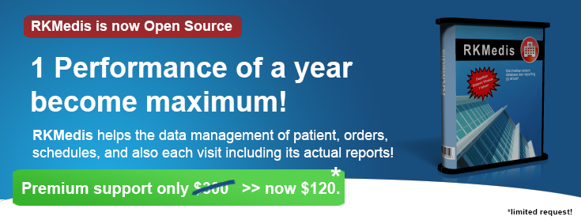

# RKMedisCustomizedRTH

Is a desktop based system that has implementing the concept of **RKMedis v1.2** (taken from https://bitbucket.org/fgroupindonesia_com/rkmedis/

## Main Features:
- small footprints from 3Mb extracted to SFX (exe file) 961kb
- officially API delegation to Https://api.fgroupindonesia.com
- support .NET 4.5.2 framework
- succesfully running on Windows 7,8, and 10
- no need DBMS installation in workstation desktop
- depend upon stable internet connectivity
- management for common entities (user, order, schedules, patient)

## Technology Involved:
- JSON Data Interchanged
- Client (mobile) communication
- HttpClient & WebUtilty
- Client (RTH Mobile) live usage (https://play.google.com/store/apps/details?id=web.id.rthmobile)

## Notes:
For your own organization implementation, **it's better to make some entities adjustment** such as : User, Order, Schedules, etc.

You may **contact our Support & Sales team for handling bigger project usage.**

(c) FGroupIndonesia, written from 2017-2020.
